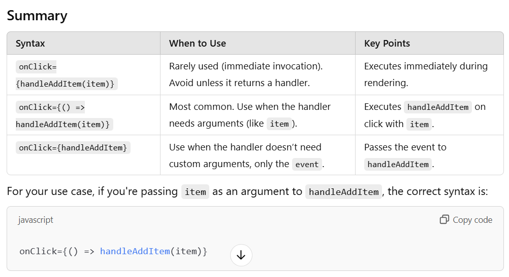

# Data is the new oil

## ep1
## Higher Order Component
- funtion that takes the compoent, enhances it and returns the component
- implemented in restaurant cards and body for promoted or open now restaurant

## Controlled and uncontrolled components 
## Lifting the state up

- data layer and ui later
- while developing accodion , we add showitem varaible which toggles each rescategory but we need when one rescategory true rest others will false this can be achive using [lifting state up] 
- lifting the state showItem to parent i,e RestaurantMenu so that parent can control All the showItem 
- so resCategory is now controlled component
- read react.dev lifting the state up (reference by akshay)
- pass data from child to parent component

## ep11 part 4
## React context api (state management)
- props drilling
- problem of passing props
- we use context in multiple component if need any state using multiple times
- two ways we can access that context state variable
1. use useContext hook  - (most commonly used)
2. - (in older way or class based comonent) used as a component
 <NameOfContext.Consumer>    
      { (data) => console.log(data) }
   </NameOfContext.Consumer>
- but we can not use usecontext hook in class based component
-  what if we wanted to change the state 
- make an api call fetch the login data and store in state using useState now suppose you want to update the userLoggedIn data in context for that use context Provider ( wrap the whole app inside the <userContext.Porvider value ={{loggedInUser: UserName}}></userContext.Provider> )
- now my loggedInUser change to userName 
- the state changes globally for our app becuase we wrap userContext.Provider to the whole app
- but what if we change the state in a portion or in one component then you can wrap userContext.Provider only that portion
- you can create multiple context 
- you can also use nested context for different different value it only depends where you provide provider

 

### lets build our app 
  - install @reduxjs/toolkit and react-redux
  - Build our store 
  - provide store Or connect store to our app  - to provide it we need a Provider 
  - create (cardSlice)
  - dispatch(action)  - actions are like add cart, delete cart or update cart 
  - use selector (Hook)

### Difference between
  1. onClick={handleAddItem(item)}
      - This approach calls the function immediately as soon as the component is rendered, rather than waiting for the click event.

      - Why? Parentheses () immediately invoke the function.
      - Problem: The handleAddItem function will execute on component load, not when the button is clicked.
      * When to Use
      - Rarely used for onClick since it results in unintended immediate execution. However, you might use this if the function is returning another function for the event handler (e.g., a curried function).    

  2. onClick={() => handleAddItem(item)}
       - This is the most common and recommended approach. Here, you're passing an anonymous arrow function to onClick, and this arrow function executes handleAddItem(item) only when the button is clicked.

      - Why? The arrow function defers the call to handleAddItem(item) until the button is clicked.
      - Behavior: The item is correctly passed as an argument when the click happens.
      * When to Use
      - Almost always for event handlers, especially when the handler requires parameters.
  3. onClick={handleAddItem(item)}
       - Here, you're passing the handleAddItem function itself as a   reference to onClick.

       *   What Happens? The onClick will call handleAddItem(event) automatically when the button is clicked. However:
       -   It doesn't allow passing additional arguments like item unless your handleAddItem function is specifically designed to handle them.
       -   The default event object is passed to the handler.
       - const handleAddItem = (event) => {
            console.log(event); // React SyntheticEvent
            };
       * When to Use
           - Use this only when the handler does not need extra arguments and relies solely on the event object.     
 

- before redux use middleware and thunks to fetch data and store in the store
- but now redux toolkit use RTK Query