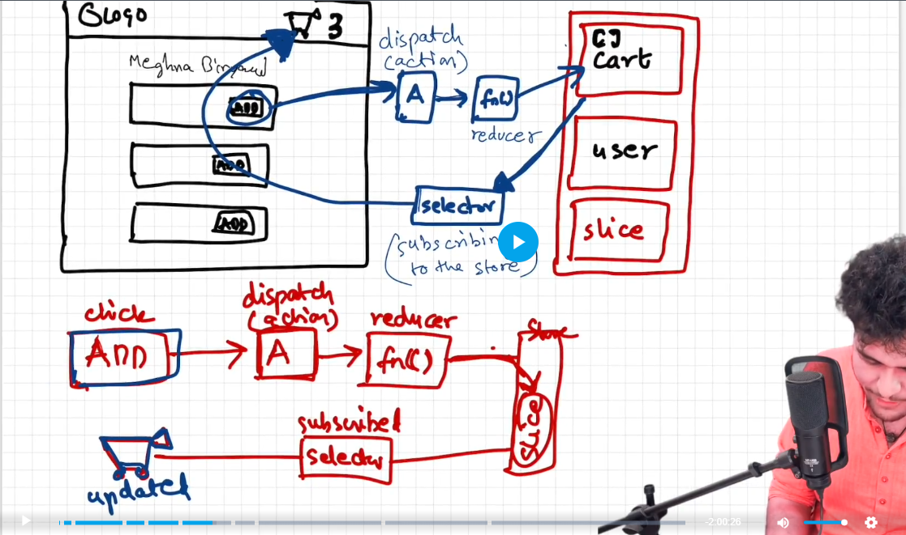

# Data is the new oil

## ep1
## Higher Order Component
- funtion that takes the compoent, enhances it and returns the component
- implemented in restaurant cards and body for promoted or open now restaurant

## Controlled and uncontrolled components 
## Lifting the state up

- data layer and ui later
- while developing accodion , we add showitem varaible which toggles each rescategory but we need when one rescategory true rest others will false this can be achive using [lifting state up] 
- lifting the state showItem to parent i,e RestaurantMenu so that parent can control All the showItem 
- so resCategory is now controlled component
- read react.dev lifting the state up (reference by akshay)
- pass data from child to parent component

## ep11 part 4
## React context api (state management)
- props drilling
- problem of passing props
- we use context in multiple component if need any state using multiple times
- two ways we can access that context state variable
1. use useContext hook  - (most commonly used)
2. - (in older way or class based comonent) used as a component
 <NameOfContext.Consumer>    
      { (data) => console.log(data) }
   </NameOfContext.Consumer>
- but we can not use usecontext hook in class based component
-  what if we wanted to change the state 
- make an api call fetch the login data and store in state using useState now suppose you want to update the userLoggedIn data in context for that use context Provider ( wrap the whole app inside the <userContext.Porvider value ={{loggedInUser: UserName}}></userContext.Provider> )
- now my loggedInUser change to userName 
- the state changes globally for our app becuase we wrap userContext.Provider to the whole app
- but what if we change the state in a portion or in one component then you can wrap userContext.Provider only that portion
- you can create multiple context 
- you can also use nested context for different different value it only depends where you provide provider

