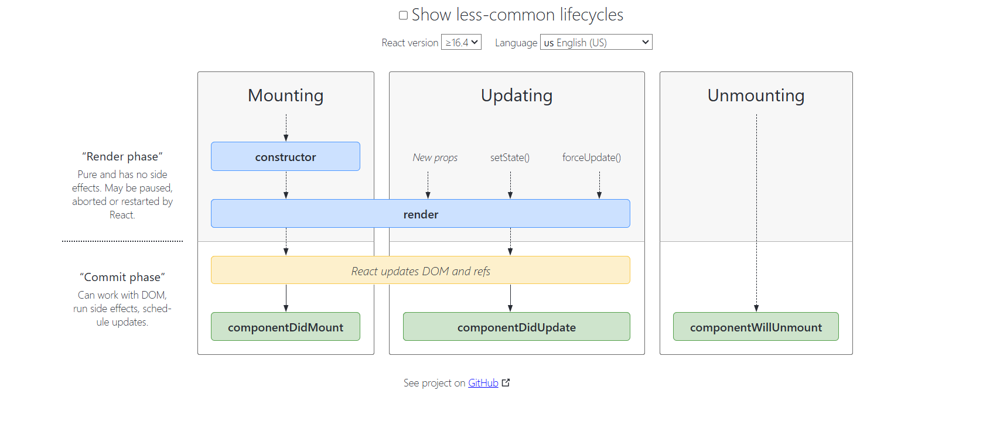

# Class based components ep8part1
- older way of creating components in react, now using function based component
- for interviews its quit important because many projects are developed using class based components
- lets first make a functional component and then change it to class component(User component)
- // Now here use User Class based component just refer User.js
- // normal js function
- // CLASS COMPONENT = has a class having render method which returns some piece of JSX
- // react.component is a class which is given by react and user  class is inheriting some property from it
- class UserClass extends React.Component

 -    // this render method will return a piece of jsx which will be displayed on UI
 - refer about component explaining User(functional component) and UserClass(class based component)

 # Class based components ep8part2
 - how we can create state variables in class based component
 - we can state variable using useState hook in functional component (new concept of react)
 - earlier there was no functional component and no hooks
 - how we can create state variable then
 - state was created whenever instance of class is created
 - component render means you are invoking or mounting a functional component
 - when you say you are creating instance of class based component
 - loading of class based component on webpage means creating an instance of class
 - whenever you create instance of class, constructor in called and this is the best place to reveive props and create state variables
 - using this.state (state is reserved word over here)
 - please refer userclass component for more details about class based component

 - now lets go through the cycle
 1. first thing when class component loads  (means creating an instance of class),
 2.  the constructor is called 
 3. then render is called
 <!-- componentDidMount is another method form react -->
4. componentDidMount called after render method called [ In componentDidMount we can make api call once component render   ]
- componentDidMount is like useEffect in functional component

# Class based components ep8part5
- /**
 * 
 * {{{{ Below is wrong }}}}
 * - Parent Constructor
 * - Parent Render
 *    
 *   - Farhan Constructor
 *   - Farhan Render
 *   - Farhan ComponentDidMount
 * 
 *   - ELon Constructor
 *   - Elon Render 
 *   - Elon ComponentDidMount
 * 
 * - Parent ComponentDidMount
 * 
 */

 - react lifecycle methods diagram
 - refer to this (https://projects.wojtekmaj.pl/react-lifecycle-methods-diagram/)

1. First Step  - [MOUNTING]
 - render phase
    - constructor called
    - render called

- commit phase
   - react updated dom and refs
   - componentDidMount called

- refer to this (https://projects.wojtekmaj.pl/react-lifecycle-methods-diagram/) 

- in above url not 
2. Second Step   - [UPDATING]
- setState updated
- render once again with updated value
- react updates DOM
- Now ComponentDidUpdate called

- why do we need unmount a component
- because if use setInterval or setTimeout there will be new setInterval created when mount component without unmounting
- interval adding in console 
- so you need to clear the interval (IMPORTANT)
- leave a not below setInterval in comment to clear the interval in ComponentWillUnmount
- how we can reference interval in componentWillUnmount 
- use this.timer = setInterval()
- and then clearInterval(this.timer)

- unmounting in functional component refer to user.js

